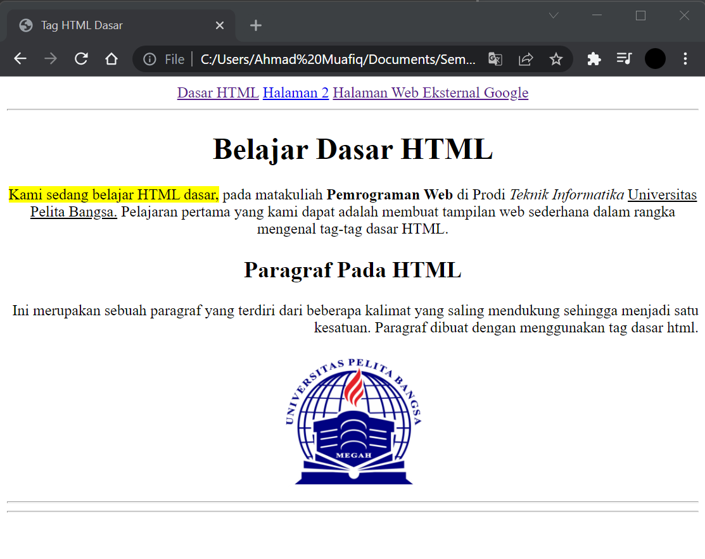

# Lab1Web
## Tugas Pemograman Web - pertemuan 2 Praktikum 1

Nama  : Ahmad Muafiq 
NIM   : 312010152 
Kelas : TI.20.B.1 

*Pada Pertemuan ke-2  pemrograman web kali ini saya akan melakukan beberapa perintah pada HTML.* 

> * Menampilkan title HTML pada browser  

 

**1. Membuat Paragraf**
 
pada tahap ini saya akan membuat paragraf pada file HTML.  
pada syntax p bertujuan untuk membuat paragraf baru. berikut tampilanya.  

- **Atribut Paragraf**

Disini saya akan merubah posisi paragraf yang sudah tersedia, yaitu paragraf pertama menjadi rata tengah dan paragraf kedua rata kanan. Berikut tampilanya.

**3. Menambahkan Judul**

Pada tahap berikutnya saya akan menambahkan judul dari materi yang telah disusun dengan perubahan ukuran font yang bebeda. Berikut tampilanya.

**4. Format teks**

selanjutnya disini saya akan sedikit mengganti format teks berupa bakground warna pda teks, ketebalan teks, teks miring dan garis bawah pada teks dalam HTML. Berikut Tampilanya.

**5. Menambahkan Gambar pada Dokumen**

Penambahan gambar pada dokumen. Berikut Tampilanya.

**6. Menambahkan Hyperlink**

Menambahkan Link tambahan atau hyperlink. Berikut Tampilanya.

> <h3>Jawab Pertanyaan Berikut</h3>
>
>
>1. Lakukan perubahan pada kode sesuai dengan keinginan anda, amati perubahannya adakah
error ketika terjadi kesalahan penulisan tag?
>
><i>jika penulisan syntax atau pun kode salah akan terjadi eror atau kesalahan dan tidak akan terdeteksi dalam web jika ada perubahan.</i>
>
>2. Apa perbedaan dari tag < p > dengan tag < br >, berikan penjelasannya!
>
><i>Jika P yaitu ganti paragraf baru,
>Jika br yaitu ganti baris baru.</i>
>
>3. Apa perbedaan atribut title dan alt pada tag < img >, berikan penjelasannya!
>
>title untuk membuat judul jika gambar tak muncul, dan jika alt untuk memberikan deskripsi pada gambar
>
>
>4. Untuk mengatur ukuran gambar, digunakan atribut width dan height. Agar tampilan gambar
proporsional sebaiknya kedua atribut tersebut diisi semua atau tidak? Berikan penjelasannya!
>
>Agar dapat menampilkan ukuran gambar yang sesuai dengan keingan menurut saya perlu diiisi semua
>
>5. Pada link tambahkan atribut target dengan nilai atribut bervariasi ( _blank, _self, _top,
_parent ), apa yang terjadi pada masing-masing nilai antribut tersebut?
>
>Atribut_blank berfungsi untuk membuka halaman pada tab baru. Atribut_self berfungsi untuk membuka halaman pada tab yang sudah terbuka. Atribut_top berfungsi untuk membuka halaman pada window barau dan layar penuh Atribut_parent berfungsi untuk membuka link di frame yang satu tinggkat diatas frame link tersebut berada.

